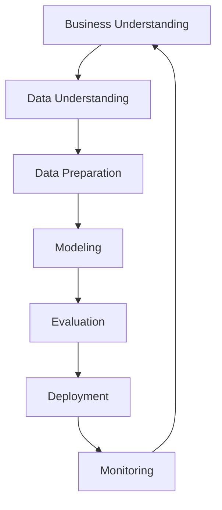

# A&D Solutions Labs 🚀

<div align="center">


**Ingeniería de Datos, Arquitectura de Éxito**

[](https://adsolutionslabs.com)
[](mailto:contacto@adsolutionslabs.com)
[](https://linkedin.com/company/adsolutionslabs)

</div>

---

## 🎯 **Sobre Nosotros**

**A&D Solutions Labs** es una empresa especializada en **Ingeniería de Datos** y **Análisis Avanzado** con sede en **Mérida, Yucatán, México**. Transformamos datos complejos en insights accionables que impulsan el crecimiento empresarial.

### 🌟 **Nuestra Misión**
Democratizar el acceso a soluciones de datos de clase mundial, ayudando a empresas de todos los tamaños a tomar decisiones basadas en información confiable y oportuna.

---

## 🛠️ **Servicios Principales**

### 🔧 **Ingeniería de Datos**
- Diseño e implementación de pipelines de datos
- ETL/ELT automatizados y escalables
- Migración y modernización de sistemas legacy
- Integración de múltiples fuentes de datos

### 📊 **Análisis de Datos**
- Análisis exploratorio y descriptivo
- Dashboards interactivos y reportes automatizados
- KPIs y métricas de negocio personalizadas
- Visualizaciones avanzadas con storytelling

### 🤖 **Ciencia de Datos**
- Machine Learning y modelos predictivos
- Análisis estadístico avanzado
- Inteligencia artificial aplicada al negocio
- Automatización de procesos analíticos

### 🔍 **Auditoría y Calidad**
- Auditorías de calidad de datos
- Implementación de data governance
- Validación y limpieza de datasets
- Compliance y seguridad de datos

### 🏗️ **Arquitectura de Datos**
- Diseño de data warehouses y data lakes
- Arquitecturas en la nube (AWS, Azure, GCP)
- Modernización de infraestructura de datos
- Estrategias de almacenamiento y backup

---

## 💻 **Stack Tecnológico**

### **Lenguajes de Programación**


### **Big Data & Analytics**


### **Cloud Platforms**


### **Bases de Datos**


### **Visualización**


### **Machine Learning**


---

## 🏆 **Casos de Éxito**

### 📈 **Retail Analytics**
- **Proyecto**: Optimización de inventario para cadena retail
- **Resultado**: 25% reducción en costos de almacenamiento
- **Tecnologías**: Python, Apache Spark, AWS Redshift

### 🏥 **Healthcare Data**
- **Proyecto**: Sistema de análisis predictivo para hospital
- **Resultado**: 30% mejora en tiempo de diagnóstico
- **Tecnologías**: R, Machine Learning, Tableau

### 🏭 **Manufacturing Intelligence**
- **Proyecto**: Monitoreo en tiempo real de líneas de producción
- **Resultado**: 40% reducción en tiempo de inactividad
- **Tecnologías**: IoT, Apache Kafka, Power BI

---

## 📊 **Metodología de Trabajo**

### 🔄 **Proceso CRISP-DM Adaptado**



### 📋 **Fases del Proyecto**

1. **🎯 Descubrimiento** - Entendimiento del negocio y objetivos
2. **🔍 Exploración** - Análisis de datos disponibles y calidad
3. **🛠️ Preparación** - Limpieza, transformación y feature engineering
4. **🧪 Modelado** - Desarrollo de modelos y algoritmos
5. **✅ Validación** - Testing, evaluación y optimización
6. **🚀 Implementación** - Despliegue en producción
7. **📊 Monitoreo** - Seguimiento continuo y mejoras

---

## 📁 **Estructura de Proyectos**

```
proyecto-cliente/
├── 📊 data/
│   ├── raw/              # Datos originales
│   ├── processed/        # Datos procesados
│   └── external/         # Fuentes externas
├── 📓 notebooks/         # Jupyter notebooks
├── 🐍 src/              # Código fuente
│   ├── data/            # Scripts de procesamiento
│   ├── features/        # Feature engineering
│   ├── models/          # Modelos ML
│   └── visualization/   # Gráficos y dashboards
├── 📋 tests/            # Pruebas unitarias
├── 📊 reports/          # Reportes y documentación
├── 🔧 config/           # Configuraciones
└── 📄 README.md         # Documentación del proyecto
```

---

## 🌟 **¿Por qué Elegir A&D Solutions Labs?**

### ✅ **Experiencia Comprobada**
- Equipo con 10+ años en análisis de datos
- Proyectos exitosos en múltiples industrias
- Certificaciones en tecnologías líderes

### 🚀 **Enfoque Innovador**
- Metodologías ágiles y adaptativas
- Últimas tecnologías del mercado
- Soluciones escalables y sostenibles

### 🤝 **Compromiso con el Cliente**
- Comunicación transparente y constante
- Entrega de valor desde el primer día
- Soporte continuo post-implementación

### 🌍 **Perspectiva Local y Global**
- Conocimiento del mercado mexicano
- Estándares internacionales de calidad
- Conexión cultural y profesional

---

## 📞 **Contacto**

### 🏢 **Información de la Empresa**
- **🌐 Website**: [adsolutionslabs.com](https://adsolutionslabs.com)
- **📧 Email**: [contacto@adsolutionslabs.com](mailto:contacto@adsolutionslabs.com)
- **📍 Ubicación**: Mérida, Yucatán, México
- **💼 LinkedIn**: [A&D Solutions Labs](https://linkedin.com/company/adsolutionslabs)

### 💬 **¿Listo para Transformar tus Datos?**

¿Tienes un proyecto de datos en mente? ¿Necesitas optimizar tus procesos analíticos? ¿Quieres implementar Machine Learning en tu negocio?

**¡Conversemos!** Envíanos un mensaje y descubre cómo podemos ayudarte a convertir tus datos en ventaja competitiva.

---

## 📜 **Licencia**

Este repositorio contiene información pública de **A&D Solutions Labs**. Para proyectos específicos y código propietario, consulta las licencias individuales de cada proyecto.

---

<div align="center">

**© 2025 A&D Solutions Labs | Todos los derechos reservados**

*Ingeniería de Datos, Arquitectura de Éxito* ✨

[](https://es.wikipedia.org/wiki/Yucatán)

</div>

<!--

**Here are some ideas to get you started:**

🙋‍♀️ A short introduction - what is your organization all about?
🌈 Contribution guidelines - how can the community get involved?
👩‍💻 Useful resources - where can the community find your docs? Is there anything else the community should know?
🍿 Fun facts - what does your team eat for breakfast?
🧙 Remember, you can do mighty things with the power of [Markdown](https://docs.github.com/github/writing-on-github/getting-started-with-writing-and-formatting-on-github/basic-writing-and-formatting-syntax)
-->
